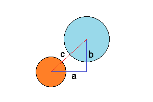
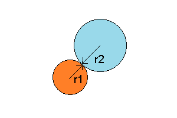

# Project Numero Uno
First project for WDI SM 23

# What it is?
Definitely not Atari's Missile Command, that's for sure! But, it is similar in the sense that objects fall from the "sky" and the user must click on the screen to remove the falling objects before they reach the bottom.

# Technologies/Frameworks Used:
1. HTML, CSS, JS
2. jQuery animation
3. SVG (scalable vector graphics) elements

# What works:
1. Missiles fall from the sky at a random rate
2. Collision detection between the players missiles and the falling missiles (not 100% yet)
3. The amount of missiles each player hits is tallied
4. The speed at which missiles fall increases as the time increases

#Collision Detection:
- The way collision detection works is by comparing the distances between the center points of each falling missile and each player's missiles and if that distance is less than the distance of the two circles radii then that registers as a hit. See below sketch. 

 

# What doesn't:
1. Collision detection does not work flawlessly
2. Missiles falling from the sky don't fall at random angles
3. When a player fires a missile, that missiles position is saved on the board until a new position is clicked
3. The game never switches turns on it's own
4. There is now way to stop the game except by refreshing the page
5. All of the CSS is positioned absolute so the game is not responsive in any way

# Instructions:
1. Press the start button to begin
2. Try your best to shoot down each falling missile by clicking on the screen in the vicintity of each falling missile (hint: click ahead of the falling missiles)
3. You have unlimited ammo so click as much as you want. Not every click will explode a missile so don't be afraid the double/triple click on each falling missile
